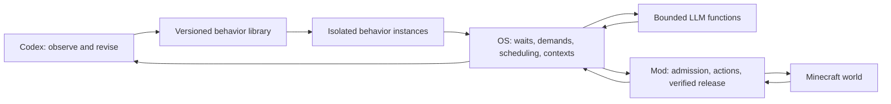

# Airicraft OS: competing behaviors on paper

Companion to [Walk through competing behaviors against the proposed contracts](https://github.com/shinohara-rin/airicraft/issues/65), within [Chart the Airicraft OS driver experiment](https://github.com/shinohara-rin/airicraft/issues/51). The linked decision resolutions are authoritative. This artifact tests whether their distinctions make concrete cases understandable; it is not a running scheduler or gameplay evidence.

The user delegated remaining decisions and this review to Codex on 2026-09-15. The examples use the beachside crops, sheep, managed birch, compost, chest and fishing scope. Sheep escape repair remains separate. No Minecraft run, inference call, or production runtime change was performed for this walkthrough.

## What belongs where

There are two different relationships: parents own child invocations; the OS owns physical activities and access contexts. Two children can subscribe to one supply activity without becoming the same child. An LLM answer is data that can help choose a request; it is not a new lease on the player.

The following cases isolate specified readiness conditions. Unmentioned higher-priority work is absent or blocked. Times are illustrative advancing game seconds unless explicitly described as wall time; they are not latency predictions.

## 1. Planting and composting cannot spend the same seeds

Starting frame E1/100 shows twenty carried wheat seeds, six empty assigned cells, and an eight-seed planting floor. Sheep are cooling down and birch is growing. The composter can accept a seed.

| Boundary | Work and ownership | Ledger and retained facts |
| --- | --- | --- |
| Admit crop patch | Crop request wins over compost; one native activity owns the player. | Planting claims six from its own eight protected seeds. Total protection stays eight, not fourteen; surplus is twelve. Native consumption allowance is six. |
| Verify six planted cells | Release the crop activity after observed effects and native release. | Carried seeds are now fourteen. Recompute protection at eight and surplus at six. The planted cells remain world effects. |
| Admit one compost insertion | Crop waits for growth with no lease; compost gets one activity. | Reserve one of the six surplus seeds. The native insertion may consume at most one. |
| Verify insertion | Compost releases the player. | Thirteen seeds remain, eight protected and five surplus. A bin level transition is observed; bone meal is not assumed to exist yet. |
| No useful land request remains | Fishing may cast and retain the actor during its bite wait. | Crop/bin/birch growth waits are passive. Fishing is active waiting, not idle. |

The floor is not an additional pile of items beside the claim. With two consumers protecting two wheat each out of four, A claiming its own two still leaves B two. If native crops can consume beyond their allowance, this entire argument fails; the native allowance is therefore a prerequisite, not an optional host optimization.

## 2. One visit serves independently authored sheep work

The frame shows two shearable adults, breeding readiness supported by fresh evidence, and two allocated wheat. Shearing and breeding are separate definitions. No overdue root is waiting initially.

| Boundary | Requests | Player/context | Result |
| --- | --- | --- | --- |
| Choose sheep work | Shear A, shear B, feed pair A/B are independently eligible. | OS enters one pen context. | Entry/setup is counted once. |
| First operation | Shear A revalidates A and the shears. | Same visit, one activity. | A's sheared state and any wool effects are observed. |
| Second operation | Shear B is still eligible. | Same visit, next activity. | No exit/reentry merely because the definition changed. |
| Third operation | Feed pair revalidates both adults and reserves two wheat. | Same visit, next activity. | Consumption/readiness evidence is recorded; a later observed lamb proves reproduction. An accepted interaction alone does not. |
| Ready work changes | Wool collection may join; an overdue crop root must be served at the next safe boundary. | OS closes the visit before giving the actor to incompatible work. | Context reuse never overrides overdue-root service or release evidence. |

Visits are limited to eight operations or sixty advancing seconds checked between operations. On expiry the visit closes; global overdue service has precedence, then a waiting outside-context turn, then normal scoring. If an overdue root needs a fresh visit to the same pen, the outside turn remains owed. If sheep escape, the trace reports unavailable opportunities and a separate fixture incident; this walkthrough does not introduce a lure/recovery duty.

## 3. Shared service does not merge consumers or outcomes

Two finite demands need two and four wheat, respectively. A single chest withdrawal of six has been accepted. This case uses finite delivery IDs, not duplicate declarations of one maintained floor.

| Event | Subscriber state | Physical service and accounting |
| --- | --- | --- |
| A and B subscribe | A owns demand DA=2; B owns DB=4. | One activity has a six-item allowance and one native request ID. |
| A is cancelled after admission | A's interest is removed and its outcome is cancellation. B remains live. | B keeps the shared service useful. Cancellation cannot undo an already accepted transfer. |
| Six wheat arrive and are verified | DB receives credit for four once. DA does not receive a successful delivery after cancellation. | The other two are observed unallocated stock; they do not disappear or become a second credited delivery. Native/window release remains required. |
| C asks for two after settlement | C is a fresh demand with a fresh applicability check. | The OS may allocate the two actual surplus items. C cannot inherit the old activity's success merely because its arguments match. |

A repeated declaration of the same consumer's maintained target does not add demand. Distinct consumers' targets do add, and cancelling one does not cancel another's invocation. If the last subscriber cancels during the transfer, the OS still verifies effects and closes its exact window before releasing the player.

## 4. A crop becomes ready while fishing

| Time/event | Ownership and decision | Time classification |
| --- | --- | --- |
| t=0: no feasible land work | Fishing casts. The hook wait retains physical ownership. | Active waiting. |
| t=12: a new frame proves crop readiness | Crop request becomes eligible; OS asks fishing to yield. | Fishing still owns the actor. Crop eligible age starts. |
| t=14: a bite appears, branch A | Retrieve immediately, then verify hook/input release and fresh crop admission. | Retrieval is productive; its required release is cleanup. |
| No bite by t=17, branch B | Reel in at the five-second yield limit, then verify release. | The remaining cast wait is bounded active waiting, not a free lease. |
| Release acknowledgement is delayed | Crop cannot start yet. The OS exposes cleanup or unresolved ownership. | Cleanup/recovery, never a claim of overlapping productive work. |

Five seconds bounds how long to wait for a bite after a ready-land notification; it does not promise the crop starts exactly five seconds later. A paused world stops this game-time window. The native wall-clock lease still fences a dead host before the next action tick.

## 5. A slow worker does not block the farm

The birch activity has failed with a recorded obstruction and has released controls. It asks a stuck-work worker to select retry, one of supplied eligible alternatives, or defer.

| Event | Birch/worker | Other duties and authority |
| --- | --- | --- |
| Call accepted | Birch passively waits on a bounded stateless call with E1 and target revisions. | Crops and sheep remain schedulable. The worker owns no player/context. |
| Eight wall seconds pass | Request remains within its twenty-second inference deadline. | A crop operation and sheep visit may complete. |
| Alternative T2 is harvested or becomes unknown | The worker's supplied candidate basis no longer authorizes T2. | The current observation records the change. |
| Worker chooses T2 | Validate schema, epoch, candidate membership and current eligibility. Discard an invalid choice; use the declared defer/fresh-choice fallback. | No native operation is admitted from stale advice. |
| Instead, caller is cancelled or world becomes E2 | Revoke its subscription; cancel transport if last subscriber. A late answer is evidence only. | It cannot resume an old invocation or obtain E2 authority. |

A model returning useful prose does not bypass validation. Missing credentials, malformed output, timeout, and stale results have deterministic fallbacks. A mock result can qualify orchestration mechanics but cannot count as the real-worker judgment experiment.

## 6. Reflex during a chest transfer

| Event | Native/OS state | Required evidence |
| --- | --- | --- |
| Withdrawal admitted | Request R owns a guarded chest window and an item/capacity allowance. | Admission receipt exists before clicks. |
| Survival reflex takes over | Native revokes the ordinary fence and controls the player. R enters interruption/cleanup. | Exact takeover generation; no competing OS actuation. |
| Job reports CANCELLED | OS keeps effects and window obligations unresolved. | Job status alone is not release proof. |
| Counts and window reconcile | Record actual transferred count; close only the owned window when the reflex/native cleanup protocol permits. | A replacement/foreign window is not blindly closed. |
| Reflex hands back and release is verified | New fence, fresh frame and atomic resource admission precede another duty. | Partially transferred items remain in the ledger; no retry of the original quantity by assumption. |

If cleanup cannot prove release, the player remains excluded from ordinary work and an incident is raised. Independent guest computation may continue, but the benchmark cannot call that physical execution healthy.

## 7. Missed events and paused growth

An instance evaluates its condition against frame E1/200 and registers the same scope/cursor atomically. A readiness update racing with registration is rechecked before it sleeps. Duplicate updates coalesce; they do not duplicate work.

If its cursor predates the retained event range, the OS reports a gap and refreshes. An unloaded/truncated region remains unknown, not an empty plot or a missing sheep. A short-lived historical event that is now absent cannot be reconstructed as success from a fresh frame. Owned operation receipts and effect reconciliation must establish that result separately.

During pause or when the area cannot advance, growth/cooldown budgets do not accrue. Worker/transport/watchdog deadlines still use monotonic wall time. When progress resumes, elapsed time alone does not prove crop maturity: the condition needs new authoritative evidence.

Freshness is also wall-clock age: a paused game does not preserve a two-second observation forever. Native checks use the native monotonic domain. The broker uses a conservative response-age plus request-elapsed bound instead of subtracting Node and Java timestamps with unrelated origins.

## 8. The host dies after acceptance but before receiving the answer

| Event | Durable/native state | Recovery behavior |
| --- | --- | --- |
| Host journals R, then submits | Journal contains payload hash/epoch; native admits R and may begin effects. | No effect is submitted without the journal entry. |
| Host dies; response is lost | Native R may have planted two of six cells. | After five wall seconds without heartbeat, old admissions are fenced and native work drains. |
| New host connects | Running JS stacks and old reservations are gone. | Do not launch new physical work until old ownership is released/reconciled. |
| Query R finds partial completion | Native receipt plus fresh frame show two planted cells and corresponding consumption. | Fresh invocation considers the four remaining cells, with a new allowance. It does not blindly resubmit six. |
| Alternative: receipt is unavailable after native restart | Old effect is explicitly unknown. | Reconcile observable cells/items. Unresolvable effects stay excluded; unrelated safe duties may continue after physical release. |
| An old-host command arrives late | It carries the revoked fence or epoch. | Native rejects it even if its arguments still look plausible. |

Deleting a guest or expiring a lease does not imply cleanup happened. Journal exhaustion refuses new effects rather than deleting unfinished obligations. Request identity includes epoch, lease generation, and submission sequence. A native high-water mark rejects an old sequence even after its detailed receipt has been evicted; it cannot become a new withdrawal.

## 9. Child failure and version replacement

A parent starts a crop child and a fishing child in the default parallel group. Crop fails; the group requests fishing cancellation, joins its terminal outcome and physical cleanup, then returns failure. With explicit collect-all, the fishing child may finish instead. An unrelated installed sheep root keeps running when physical authority permits. A parent's ordinary return also joins children; there is no silent detached wheat-waiting child.

Completed children free live-instance capacity, but their parent-owned result slots remain until joined. After sixty-four unjoined child handles, that parent cannot admit another child until it consumes a result; a global limit applies as well. This prevents an infinite sequence of completed-but-unjoined children from growing broker memory while appearing to use no live VMs.

When Codex installs revision B, revision A stops new offers and drains its owned work first. Shared service can remain for another root. B starts fresh against current world evidence; it does not inherit A's generator frame or rewind its planted crops. Reusing B against a second compatible plot binding establishes definition reuse, not a second scheduler implementation.

## Review result

The cases can be expressed without a behavior manually orchestrating every pen/chest visit or every concurrent duty. The distinctions that make this possible are consumer demand versus shared service, invocation outcome versus physical release, frame freshness versus event notification, and worker advice versus action authority.

The source audit exposed concrete prototype gaps: stock floors counted again with claims, crop passes bypassing the ledger, cancelled jobs reporting before cleanup, unbounded cast latency after land becomes ready, and no native fence after host death. The resolved contracts require those changes at shared boundaries. None requires expanding sheep recovery or implementing an embedded author.

The contract review also closed six ambiguities: active claims take precedence over redistribution after a shortage; overdue FIFO takes precedence over the owed outside-context turn; native sequence history distinguishes new from evicted requests; child-result admission has its own bounded capacity; a terminal root fault is an explicit incident rather than an unspecified restart budget; and freshness declares both its wall clock and its cross-process age calculation. Evaluation accounting now separates blocking orchestration overhead from work it overlaps. Per-transition opportunity denominators are part of the evaluation handoff.

This is a consistency walkthrough, not validation of an implementation, a fairness measurement, a sandbox security result, or proof of higher production. Numeric limits and required native changes must pass the staged qualification and matched trials in [Choose the staged driver experiment and evaluation plan](https://github.com/shinohara-rin/airicraft/issues/66).
